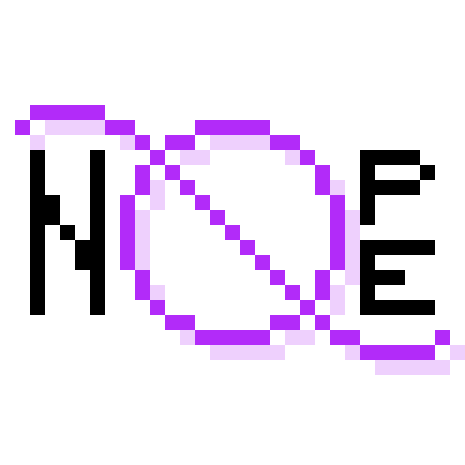

# Nope v1 - Beta

Nope is a powerful, modular, administrative Minecraft protection plugin written for Sponge servers by PietElite. 

Nope is similar to [WorldGuard](https://github.com/EngineHub/WorldGuard) in that
it allows the user to alter standard game behaviour within containers.
The primary goals of the plugin is to:
- Provide Minecraft server administrators with advanced control over portions of their Sponge server
- Provide Sponge developers with a powerful API to implement their own modular functionality
- Be as lightweight and as fast as possible

## Features
- More than 50 default settings that can be set on certain regions (`Zone`s) of a world, on an entire world, or the entire server
- **Many settings can evaluate to multiple values** to allow for greater control and granularity
- `Zone`s can have multiple volumes, so they can be combined to create more complex shapes with unified behavior
- `Zone` volumes come in various shapes, like spheres, cylinders, and cuboids
- A chat-based GUI to for easier assignment of settings
- Per-setting targeting of effect to easily ensure the correct users are affected
- Smart restriction of behavior to automatically ensure administrative personnel are not adversely affected by protections
- An API to allow easy creation of custom settings and custom setting-related event handlers
- `Host` context compatibility to enable context-dependent permissions with your permissions plugin

## Terminology
| Term | Definition |
| :----: | :------: |
| `Setting` | A combination of a `Setting Key` and a `Setting Value` that presumably changes game behavior in some way |
| `Host`  | Something on which settings may be applied |
| `Global`/Server | The `Host` that applies its settings everywhere | 
| `Domain`/World | The `Host` that applies its settings everywhere inside a specific Minecraft world |
| `Zone` | A `Host` that applies its settings to a set of `Volume`s |
| `Volume` | A 3-dimensional region to partially manifest the location of a `Zone` |
| `Target` | The criteria to identify the intended group of users affected by a `Setting` |

## Why Beta?

Nope v0 was developed for Sponge API 7 and has since been fully deprecated in favor of revamping the entire project.
As such, support for Sponge API 7 and other earlier versions of Sponge will not be supported.

Nope v1 is new and is developed for Sponge API 8 and will be fully released when all of:
- [ ] A stable release of Sponge using API 8 has been released
- [ ] Nope's internal functionality has been fully tested
- [ ] All of Nope's individual default setting handlers have been tested
- [ ] All pending design decisions have been addressed and implemented

You can help with all of these tasks! I greatly encourage you to download the plugin and try it out
if you are searching for a robust administrative tool for your Sponge API 8 server.
Now is the time to request changes and features and report bugs, so they don't come up in the official release.
Create an issue on this repository to share your thoughts.
You can also head over to [Sponge](https://github.com/SpongePowered/Sponge) to contribute.

## Installation

To install the plugin, first [install Sponge](https://docs.spongepowered.org/stable/en/server/index.html). 
Put Nope's jar file into the `mods` folder of your server and run the server normally.
We suggest you also install a permission-management plugin.

## Contact

- [Issues](https://github.com/pietelite/nope/issues)
- [Discord](https://discord.gg/EmjQpqj6ps)